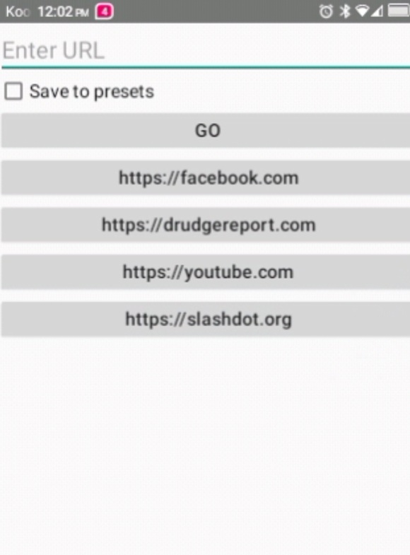

# Goto Firefox

A tiny companion app for Android devices that have a D-Pad and lack a touchscreen (such as a 
flip phone). Firefox's address bar doesn't respond to the D-pad's Enter key - there is no 
way to navigate to the URL you entered into the address bar.

NOTE: This app is hard-coded to use Firefox but can be easily changed to use any browser (see below). 

## Screenshot



## Why this exists

On devices with no touchscreen and no hardware keyboard — just a D-pad — typing a URL
into Firefox and pressing the D-pad's center/OK button does nothing. The keypress reaches 
the address bar (confirmed via `uiautomator` inspection), but Firefox's Compose-based 
toolbar doesn't act on it, likely because it's only wired to react to IME-routed input 
(a real keyboard's Enter, or a touchscreen's on-screen "Go" action) — not a raw D-pad-sourced 
key event. A real hardware keyboard's Enter key works fine in the same field; only D-pad-sourced 
Enter is ignored. Other browsers (tested with Opera Mini) show the same failure pattern, so this 
isn't Firefox-specific — it's how these apps generally handle D-pad input in text fields.

## What this app does

The app is a simple screen with a text field and a real, standard Android `Button` labeled 
"Go". Standard buttons get D-pad click handling for free from Android's normal 
focus-navigation system, so this part works reliably. Press Go, and the app builds a proper 
`https://` URL and hands it to Firefox via an explicit `Intent`, then closes itself.

Features:
- Manual URL entry with a working Go button
- Optional "Save to presets" checkbox — saves the URL to a scrollable list of one-tap
  shortcut buttons for sites you visit often
- Long-press a preset to delete it (with a confirmation dialog)
- Share-to: appears in Android's Share sheet, so a link from any other app can be sent
  straight through to Firefox
- Persists presets across restarts via `SharedPreferences`

## Requirements

- Firefox for Android must be installed (package `org.mozilla.firefox`) — this app is a
  launcher for it, not a browser itself
- Android 7.0+ (`minSdk 24`)

## Building

Open in Android Studio, let Gradle sync, then Run with a device connected. Or from the
command line with a local Gradle install:

```
gradle wrapper
./gradlew assembleDebug
```

APK lands in `app/build/outputs/apk/debug/`.

## Using a different browser

By default, this app launches URLs directly in Firefox (`org.mozilla.firefox`). If you're
using a different browser — for example, if you've run into the same D-pad Enter issue
in Firefox and switched to something else — there are two ways to change this.

### Option A: Hardcode a specific browser

In `MainActivity.kt`, find this line inside `launchUrl()`:

```kotlin
startActivity(Intent(Intent.ACTION_VIEW, Uri.parse(url)).apply {
    setPackage("org.mozilla.firefox")
})
```

Replace `"org.mozilla.firefox"` with your browser's package name. Common ones:

| Browser              | Package name                   |
|----------------------|--------------------------------|
| Firefox              | `org.mozilla.firefox`          |
| Opera Mini           | `com.opera.mini.native`        |
| Chrome               | `com.android.chrome`           |
| Brave                | `com.brave.browser`            |
| Via Browser          | `mark.via.gp`                  |
| Edge                 | `com.microsoft.emmx`           |
| DuckDuckGo           | `com.duckduckgo.mobile.android`|

Not sure of a package name for something not listed? With the browser installed on your
device, run this command: adb shell pm list packages | findstr /i <part of the browser's name>
(NOTE: use `grep -i` instead of `findstr /i` on macOS/Linux)

### Option B: Let the user pick which browser to use each time

Remove the `setPackage(...)` line entirely:

```kotlin
startActivity(Intent(Intent.ACTION_VIEW, Uri.parse(url)))
```

Without a target package specified, Android shows its standard chooser (or opens directly
if only one browser is installed) instead of always going to a hardcoded app. Useful if
you switch browsers occasionally, or want to keep this app browser-agnostic for others
forking it — at the cost of an extra tap each time versus a direct, silent hand-off.

## Trademark notice

This project is an independent, unofficial utility and is **not affiliated with,
endorsed by, or sponsored by Mozilla**. The Firefox name and logo are trademarks of the
Mozilla Foundation. The app icon uses Mozilla's official Firefox product icon, used
under the terms published at
[design.firefox.com](https://design.firefox.com/) /
[Photon Design System product identity assets](https://firefox-dev.tools/photon/visuals/product-identity-assets.html)
(vector assets under CC-BY 3.0+, bitmap assets under MPL 2.0). If you fork this project
for a different purpose, please review those terms yourself before reusing the icon.

## License

MIT — see [LICENSE](LICENSE). (Covers this project's own code only; the Firefox
trademark/icon usage above is governed separately by Mozilla's own terms.)
