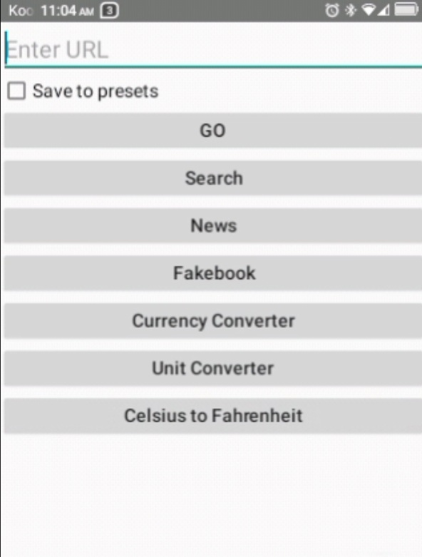
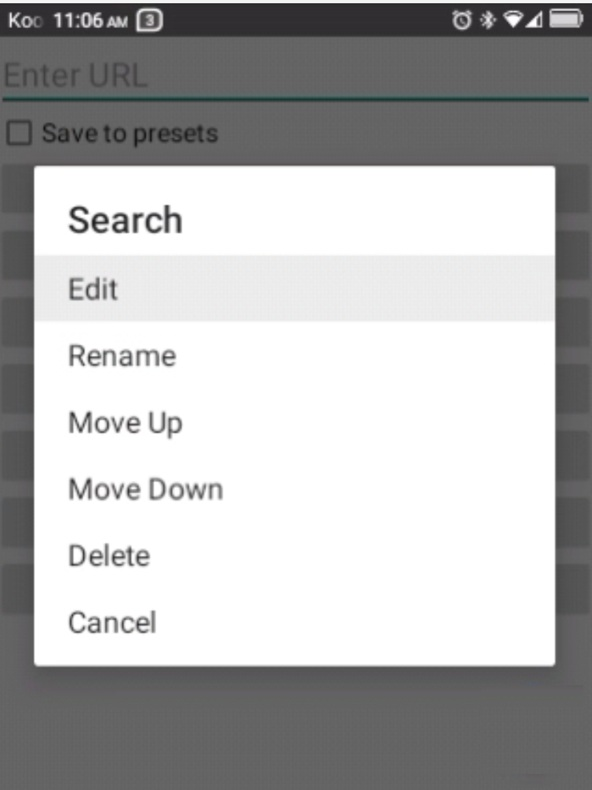
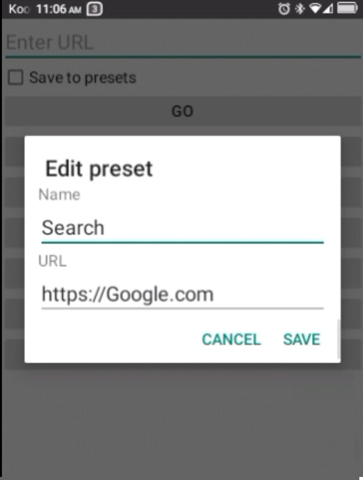

# Goto for Firefox

A tiny companion app for D-pad-only Android devices (flip phones, feature-phone-style
hardware) where Firefox's address bar doesn't respond to the D-pad's Enter key.

## The problem this solves

On devices with no touchscreen and no hardware keyboard — just a D-pad — typing a URL
into Firefox for Android and pressing the D-pad's center/OK button does nothing. The
keypress reaches the address bar (confirmed via `uiautomator` inspection), but Firefox's
Compose-based toolbar doesn't act on it, likely because it's only wired to react to
IME-routed input (a real keyboard's Enter, or a touchscreen's on-screen "Go" action) —
not a raw D-pad-sourced key event. A real hardware keyboard's Enter key works fine in
the same field; only D-pad-sourced Enter is ignored. Other browsers (tested: Opera Mini)
show the same failure pattern, so this isn't Firefox-specific — it's how these apps
generally handle D-pad input in text fields.

## What this app does

It sidesteps the problem entirely rather than fixing it: a simple screen with a text
field and a real, standard Android `Button` labeled "Go". Standard buttons get D-pad
click handling for free from Android's normal focus-navigation system, so this part
works reliably. Press Go, and the app builds a proper URL (or a search query, see
below) and hands it to Firefox via an explicit `Intent`, then closes itself.

## Screenshots

| Main screen | Preset menu | Edit preset |
|---|---|---|
|  |  |  |

## Features

- Manual URL entry with a working Go button
- **Search fallback**: if what you typed doesn't look like a URL (no domain shape —
  e.g. `currency converter` instead of `xe.com`), it's sent to Brave Search
  (`search.brave.com`) as a query instead of failing to navigate
- Optional "Save to presets" checkbox — saves the resolved destination (URL or search)
  to a scrollable list of one-tap shortcut buttons
- Long-press a preset for a menu:
  - **Rename** — give a cryptic URL a friendly display name (e.g. "Currency Converter"
    instead of the raw `xe.com` link)
  - **Edit** — change both the name and the underlying URL
  - **Move Up / Move Down** — manually reorder presets (no drag-and-drop, since that
    doesn't work well without a touchscreen)
  - **Delete** — with a confirmation prompt
- Share-to: appears in Android's Share sheet, so a link from any other app can be sent
  straight through to Firefox
- Persists presets across restarts via `SharedPreferences`

## Requirements

- Firefox for Android must be installed (package `org.mozilla.firefox`) — this app is a
  launcher for it, not a browser itself
- Android 7.0+ (`minSdk 24`)

## Building

Open in Android Studio, let Gradle sync, then Run with a device connected. Or from the
command line with a local Gradle install:

```
gradle wrapper
./gradlew assembleDebug
```

APK lands in `app/build/outputs/apk/debug/`.

## Download

Pre-built APK available on the
[Releases page](https://github.com/jevdemon/goto-firefox/releases) — no build tools
required.

## Installing

This app isn't on the Play Store — you'll sideload the APK directly.

### Requirements
- Firefox for Android must already be installed on your device (or edit the target
  browser — see [Using a different browser](#using-a-different-browser))
- "Install from unknown sources" enabled for whichever app you use to install it

### Option A: Install via adb (recommended for D-pad-only / non-touchscreen devices)

If your device is like the one this was built for — no touchscreen, D-pad only —
downloading and tapping the APK on-device usually isn't practical. Install from a PC
instead:

1. Download the APK from the
   [Releases page](https://github.com/jevdemon/goto-firefox/releases)
2. Enable USB debugging on your device and connect it via USB
3. From a command prompt/terminal, in the folder where you downloaded the APK:
   ```
   adb install goto-firefox.apk
   ```
4. The app will appear in your app drawer

### Option B: Install directly on-device (touchscreen devices)

1. Download the APK from the [Releases page](https://github.com/jevdemon/goto-firefox/releases)
   using your device's browser
2. Open the downloaded file from your notifications or file manager
3. Confirm the "install from unknown sources" prompt if it appears
4. Install

### Verifying the download (optional but recommended)

Confirm the file wasn't altered in transit by checking its SHA-256 hash matches the one
listed on the [Releases page](https://github.com/jevdemon/goto-firefox/releases)

```
certutil -hashfile goto-firefox.apk SHA256
```
(Windows; use `shasum -a 256 goto-firefox.apk` on macOS/Linux)

## Using a different browser

By default, this app launches URLs directly in Firefox (`org.mozilla.firefox`). If
you're using a different browser, there are two ways to change this.

### Option A: Hardcode a specific browser

In `MainActivity.kt`, find this line inside `launchUrl()`:

```kotlin
startActivity(Intent(Intent.ACTION_VIEW, Uri.parse(url)).apply {
    setPackage("org.mozilla.firefox")
})
```

Replace `"org.mozilla.firefox"` with your browser's package name. Common ones:

| Browser | Package name |
|---|---|
| Firefox | `org.mozilla.firefox` |
| Opera Mini | `com.opera.mini.native` |
| Chrome | `com.android.chrome` |
| Brave | `com.brave.browser` |
| Via Browser | `mark.via.gp` |
| Edge | `com.microsoft.emmx` |
| DuckDuckGo | `com.duckduckgo.mobile.android` |

Not sure of a package name for something not listed? With the browser installed on your
device, run:
```
adb shell pm list packages | findstr /i <part of the browser's name>
```
(use `grep -i` instead of `findstr /i` on macOS/Linux)

### Option B: Let the user pick each time

Remove the `setPackage(...)` line entirely:

```kotlin
startActivity(Intent(Intent.ACTION_VIEW, Uri.parse(url)))
```

Without a target package specified, Android shows its standard chooser (or opens
directly if only one browser is installed) instead of always going to a hardcoded app.

## Trademark notice

This project is an independent, unofficial utility and is **not affiliated with,
endorsed by, or sponsored by Mozilla**. The Firefox name and logo are trademarks of the
Mozilla Foundation. If you use any of Mozilla's icon assets in your own build, review the terms
at [design.firefox.com](https://design.firefox.com/) yourself before reusing them.

## License

MIT — see [LICENSE](LICENSE). (Covers this project's own code only; any Firefox
trademark/icon usage is governed separately by Mozilla's own terms.)